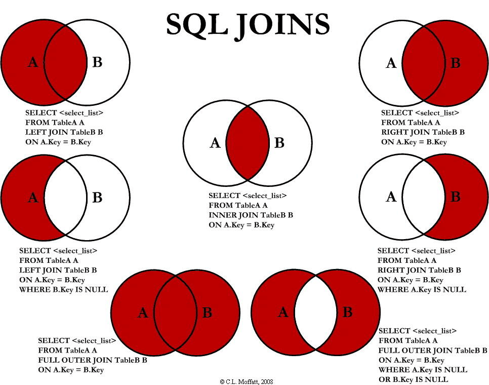

#### SQL Select 语句完整的执行顺序：
1、from 子句组装来自不同数据源的数据；
2、where 子句基于指定的条件对记录行进行筛选；
3、group by 子句将数据划分为多个分组；
4、使用聚集函数进行计算；
5、使用having 子句筛选分组；
6、计算所有的表达式；
7、select 的字段；
8、使用order by 对结果集进行排序

- ifnull(x,0) 如果x为null返回0
#### 在 SQL 中增加 HAVING 子句原因是，WHERE 关键字无法与聚合函数一起使用。
```sql
SELECT Websites.name, Websites.url, SUM(access_log.count) AS nums FROM (access_log
INNER JOIN Websites
ON access_log.site_id=Websites.id)
GROUP BY Websites.name
HAVING SUM(access_log.count) > 200;
```
#### join
```sql
SELECT column1, column2, ...
FROM table1
JOIN table2 ON condition;
```


#### DATEDIFF('2016-09-30', '2012-12-31')
Sql Server 第二个参数减第一个参数
MySQL 第一个参数减第二个参数

